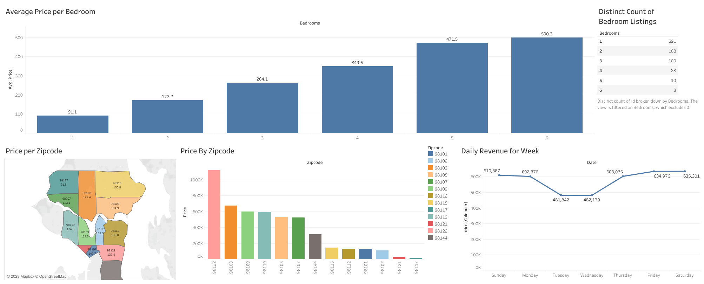

# Seattle-Airbnb-Tableau-project
Seattle Serenity: Exploring Airbnb Trends and Insights through Tableau

# Kaggle Dataset
https://www.kaggle.com/datasets/airbnb/seattle

The following Airbnb activity is included in this Seattle dataset:

* Listings, including full descriptions and average review score.
* Reviews, including unique id for each reviewer and detailed comments.
* Calendar, including listing id and the price and availability for that day.

# Objective

The objective of this Tableau project is to analyze and visualize Seattle Airbnb data comprehensively, providing valuable insights for both hosts and travelers. By exploring key metrics such as pricing trends, customer reviews, and geographical distribution of listings, this project aims to empower hosts to optimize their listings for higher revenue and customer satisfaction. Through interactive and visually appealing Tableau dashboards, the project intends to offer actionable insights, fostering a better understanding of the Seattle Airbnb market dynamics and enhancing the overall Airbnb experience for hosts and guests alike.

# Inspiration

* What are the busiest times of the year to visit Seattle? By how much do prices spike?
* Is there a general upward trend of both new Airbnb listings and total Airbnb visitors to Seattle?
* What are the main factors which decide the price of an Airbnb?
* How much Competition exist in the market?
* How price differs with vibe of each Seattle neighborhood?

# Insights

* The best time to book an Airbnb are on Tuesdays & Wednesdays as the price is the least in comparison.
* The Dashboard makes it easy to see the general trends involving Airbnb's.
* prices vary with different zipcode as shown.
* Although the places with more number of bedroom are low but the most revenue are also from Airbnb with higher number of bedrooms.

# Dashboard
LINK : https://public.tableau.com/views/AirbnbFullProject_16965157768000/Dashboard1?:language=en-US&publish=yes&:display_count=n&:origin=viz_share_link

